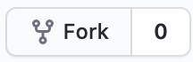

# Fork and Clone
Now, you should be ready to get started on your `git` and Github learning journey!

## Fork
To start, fork this repository.
You can do this by clicking the Fork button in the top right:



You should get a modal asking you where to fork the repository:
Choose the account we created in [the installation topic](00-installation-and-registration.md).

Now you've got your own instance of this repository - congrats!

## Clone
The only thing left to do before we can really get into the meat of things is to `git clone` your repository locally.
Click the clone button, which should open into a menu.


As you can see, you can either clone with `https`, `ssh`, or `GitHub CLI`.
In this course, we'll only be covering `https` and the `ssh` methods.
If you set your account up with an `ssh` key, feel free to use `ssh` here.
Otherwise, clone with `https`.

To do so, run this command in your favorite terminal:

```bash
git clone <THE LINK FROM YOUR FORK>
```

If it worked, you should see a `git-fundamentals` folder appear at the location where you ran `git clone`!

[Prev](00-installation-and-registration.md) - [Home](../README.md) - [Next](02-main-flow.md)
