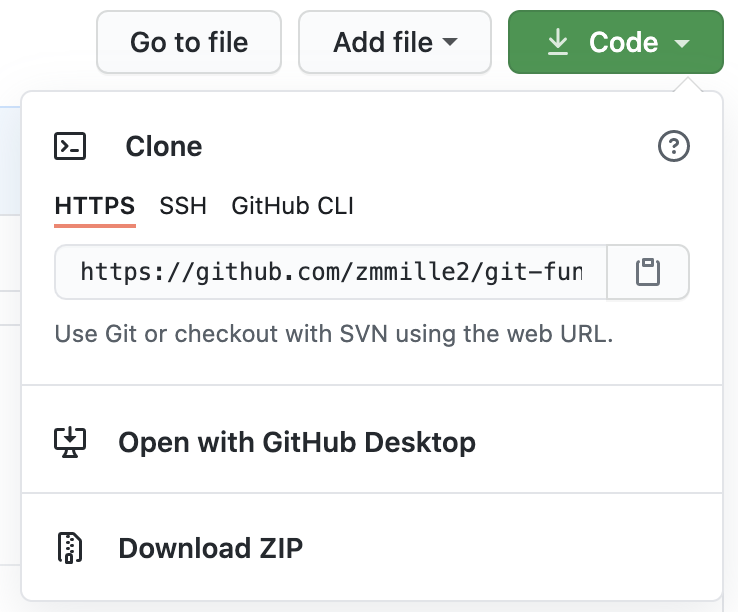

# Fork and Clone
Now, you should be ready to get started on your `git` and Github learning journey!

## Fork
To start, fork this repository.
You can do this by clicking the Fork button in the top right:


You should get a modal asking you where to fork the repository:
Choose the account we created in [the installation topic](00-installation-and-registration.md).

Now you've got your own instance of this repository - congrats!

## Clone
The only thing left to do before we can really get into the meat of things is to `git clone` your repository locally.
Click the clone button, which should open into a menu.



As you can see, you can either clone with `https`, `ssh`, or `GitHub CLI`.
In this course, we'll only be covering `https` and the `ssh` methods.
If you set your account up with an `ssh` key, feel free to use `ssh` here.
Otherwise, clone with `https`.

To do so, run this command in your favorite terminal:

```bash
git clone <THE LINK FROM YOUR FORK>
```

If you chose to clone with `ssh` you should be done here - otherwise, `git` should ask for your Github credentials.

If it worked, you should see a `git-fundamentals` folder appear at the location where you ran `git clone`!

## Summary

So what did we do in this section, exactly?
First, we forked the repository.
A repository is a copy of the project that exists somewhere.
Because `git` is decentralized, this could be a server, or a person's local machine.
Notably, a repository contains not only information about the current files on a system, but also snapshots of files as they existed in the past.

Read more about what a repository is [here](https://www.geeksforgeeks.org/what-is-a-git-repository/).

When we fork a repository, we make a copy of it that we can mess around with without changing the permissions, code, or other aspects of the project.
This is nice if you just want to change parts of a project, or if you want to make a contribution to a project, but you're not a maintainer.
[This link](https://www.toolsqa.com/git/git-fork/) covers forks in a lot more detail.

Pulling a project down to a local machine is called [cloning it](https://www.toolsqa.com/git/git-clone/).
The main difference between a clone and a fork are permissions and how you interact with the repository you've forked or cloned.
Forks make pull requests, clones can push directly (although repositories can set up guards for certain branches - [this post](https://www.toolsqa.com/git/difference-between-git-clone-and-git-fork/) goes into much more detail if you're curious).

---
[Prev](00-installation-and-registration.md) - [Home](../README.md) - [Next](02-main-flow.md)
