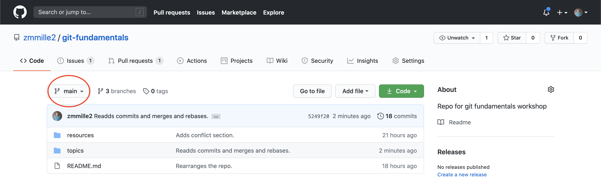

# Main Flow
To really get started with `git`, let's cover the main flow.
Note that this section is going to move fast, and there may be some unfamiliar terminology - that's ok!
We'll cover this as a starting point, and dissect it later.

**Follow along in VSCode!**

```bash
git checkout main
git pull
git checkout -b <BRANCH-NAME>
// Make changes in your favorite editor!
git add .
git commit -m "A message"
git push
// Make a pull request
```
## `git checkout main`
Make sure you're on the default branch for your repository.
**This repository uses `main`.**

NOTE: While `main` is gaining popularity as the default branch, old repositories will likely refer to `master` here.
On the landing page of the project, you can see the branch name near the top left.



## `git pull`
This will `pull` in the most recent changes from the remote branch.

## `git checkout -b <BRANCH-NAME>`
**Create a new branch called `<BRANCH-NAME>` to start working in.**
Call it whatever you like - your name, or your Github alias, for example.
Notably, this will be based off the branch that you were in when you ran the command.

## Make changes in your favorite editor
You can use VSCode here if you like, or the terminal.
**Change instances of `<BRANCH-NAME>` with whatever you called your branch!**

## `git add`
Now you have changes in your working directory.
If you run `git status` from your `git-fundamentals` directory, you can see `git` is aware of these changes, but that they aren't staged for commit.

```bash
zach@US0003EMPL001 git-fundamentals % git status
On branch zmmille2
Changes not staged for commit:
  (use "git add <file>..." to update what will be committed)
  (use "git restore <file>..." to discard changes in working directory)
        modified:   topics/02-main-flow.md

no changes added to commit (use "git add" and/or "git commit -a")
```

On the fourth line, `git` helpfully tells us we should `add` to update what will be committed, so make sure to run `git add topics/02-main-flow.md`.

## `git commit -m "A message"`

Now, your `git status` should look like this:

```bash
zach@US0003EMPL001 git-fundamentals % git status
On branch zmmille2
Changes to be committed:
  (use "git restore --staged <file>..." to unstage)
        modified:   topics/02-main-flow.md
```

Again from `git-fundamentals`, run `git commit -m ""` with a helpful message in the quotes.
It can be whatever you like, but there are [some great guidelines](https://gist.github.com/robertpainsi/b632364184e70900af4ab688decf6f53) on how to write good ones.
These messages help future you and developers like you!

For now **let's run `git commit -m "Updates branch name variable to <BRANCH-NAME>"`** (But update that instance too).

## `git push`

Now `git status` should look like this:

```bash
zach@US0003EMPL001 git-fundamentals % git status
On branch zmmille2
nothing to commit, working tree clean
```

If we run `git push`, `git` may complain about not having an upstream, and ask you to tell it what to use.

```bash
fatal: The current branch <BRANCH-NAME> has no upstream branch.
To push the current branch and set the remote as upstream, use

    git push --set-upstream origin <BRANCH-NAME>
```

Either run the provided command, or run this:
```bash
git config --global push.default current
```
There's a good post [here](https://stackoverflow.com/questions/948354/default-behavior-of-git-push-without-a-branch-specified) talking about why this is the case.

## Pull Requests

Finally, let's make a pull request showcasing these changes.
Luckily, after a `push`, there should be a link to make a pull request right away.

```bash
zach@US0003EMPL001 git-fundamentals % git push
Enumerating objects: 58, done.
Counting objects: 100% (58/58), done.
Delta compression using up to 4 threads
Compressing objects: 100% (54/54), done.
Writing objects: 100% (56/56), 188.93 KiB | 7.27 MiB/s, done.
Total 56 (delta 26), reused 0 (delta 0)
remote: Resolving deltas: 100% (26/26), done.
remote: 
remote: Create a pull request for 'zmmille2' on GitHub by visiting:
remote:      https://github.com/zmmille2/git-fundamentals/pull/new/zmmille2
remote: 
To https://github.com/zmmille2/git-fundamentals.git
 * [new branch]      zmmille2 -> zmmille2
```

Add a title and description, and go ahead and create it!

## Summary

And that's it!
That's the main loop for using `git`.

What new tools did we cover in this section?
`git pull` grabs commits from the remote branch and merges them - it's a `git fetch` and a `git merge` all in one!

There's quite a few new terms there, so let's break it down.

### Commits
Commits in `git` are snapshots of files at certain times.
While lots of people think of commits as the _changes_ to the files, that's not technically true - `git` stores _snapshots_ of the files at each commit.

Read more about commits [in the `git` book](https://www.git-scm.com/book/en/v2/Getting-Started-What-is-Git%3F), they've got a wonderful intro to them.

### Branches
Ok, so `git pull` grabs commits, that makes sense, but what is a branch now?
A branch is a series of commits that `git` tracks under a name.
They're great because you can work on features without affecting your copy of the main branch.
When something breaks in the main build, you can instantly pivot gears to work on a fix, without losing track of the state of your feature branch.

To start a new branch, just run `git checkout -b <BRANCH-NAME>`.
If the branch already exists and you just want to switch to it, just skip the `-b` flag.

The `git` book has [a great chapter on branching](https://www.git-scm.com/book/en/v2/Git-Branching-Branches-in-a-Nutshell#ch03-git-branching).

Worth calling out is the fact that the server has branches just like your local machine does.
When you ran `git push`, `git` complained about not having an "upstream" branch, remember?

```bash
fatal: The current branch <BRANCH-NAME> has no upstream branch.
To push the current branch and set the remote as upstream, use

    git push --set-upstream origin <BRANCH-NAME>
```

While you created a branch on your local machine, you hadn't created a branch on the server yet.
`git`'s default behavior is to ignore those pushes and give you a fatal error (rude).

So, when we say that `git pull` grabs changes from the remote branch, we mean the branch on the server (which `git` calls upstream, since it could be a server, or just your buddy's computer).
That way, any changes in the project on the server will get propogated to your machine.

### Fetch
Cool, we're about halfway through the sentence.
While we need to know what a `git merge` is, let's cover what a `fetch` is first.

Because `git` strives to be decentralized, it tries to keep as many operations local as possible.
So, when we say that you're interacting with a remote branch, sometimes `git` can be sneaky about it.

`git` keeps a local copy of what its understanding of the remote branch is.
`git fetch` updates that copy with what's actually on the server, but it doesn't put those changes in your branch yet.

Read more about them [here](https://www.atlassian.com/git/tutorials/syncing/git-fetch)!

### Merges
That last bit, `git merge`, merges the work done in two different branches to the same file.
When it can, `git` will just do this automatically for you.
This next section will cover what happens when things don't run quite so cleanly, and we'll explore more about `merge` and other conflict resolution strategies there.

---
[Prev](01-fork-and-clone.md) - [Home](../README.md) - [Next](03-resolving-conflicts.md)
