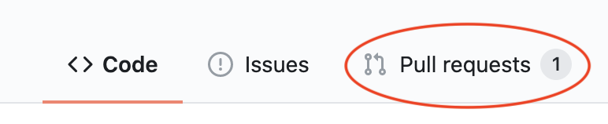
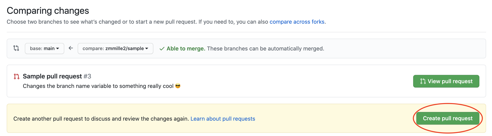
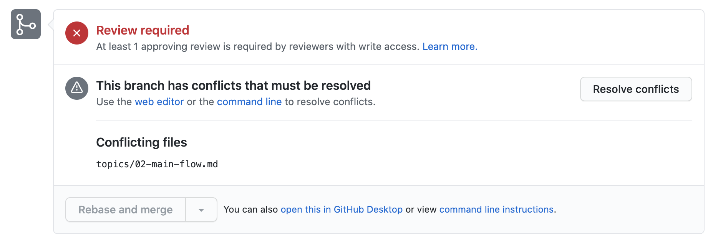

# Resolving Conflicts
So far, we've just covered the main flow, but working with software is never so simple; if it were, we wouldn't need the powerful version control systems we have.
`git` is great at handling changes, but sometimes it needs insight to know how to handle two people editting the same file at once.

## Cause a Conflict
In your repo, you should have your pull request (PR) open.



Click on the PR tab pictured and create a new 
Let's open another PR with a branch another devleoper worked on.
Set the compare to `zmmille2/sample`, and the base to `main`.
Then, create a new PR.


(Yours will look slightly differently if you haven't made the PR in the past already.)

Github should allow you to just merge this PR.
However, going back to your PR, you'll see an issue...



To fix conflicts, we're going to have to use `merge`s or `rebase`s.
While we'll go into the specifics of each in a moment, we'll start with `rebase`s.

## Fix a Conflict

Fixing conflicts also has a main loop.

**Follow along in VSCode!**

```bash
git checkout main
git pull
git checkout <BRANCH-NAME>
git rebase main
// resolve conflicts in your editor of choice
git push --force-with-lease // CAREFUL HERE
// conflict resolved!
```

Because we've covered some of these steps, we'll cover them a bit quicker...

### `git checkout main` and `git pull` and `git checkout <BRANCH-NAME>`
These three commands do what they look like.
At a high level, they make sure that your `main` branch has the changes in it that are causing the conflicts.
It also puts you back in the branch that you've been working in, where we can get to the meat of this fix.

### `git rebase main`
This one's a new command.
`rebase`ing rewinds your changes, takes the target branch (in this case, `main`), and replays the changes onto that branch.
We'll get into the specifics in the next section, but when you run this command, you'll see the conflict locally.

```bash
zach@US0003EMPL001 git-fundamentals % git rebase main
First, rewinding head to replay your work on top of it...
Applying: Changes the branch name to something really cool
Using index info to reconstruct a base tree...
M       topics/02-main-flow.md
Falling back to patching base and 3-way merge...
Auto-merging topics/02-main-flow.md
CONFLICT (content): Merge conflict in topics/02-main-flow.md
error: Failed to merge in the changes.
Patch failed at 0001 Changes the branch name to something really cool
hint: Use 'git am --show-current-patch' to see the failed patch
Resolve all conflicts manually, mark them as resolved with
"git add/rm <conflicted_files>", then run "git rebase --continue".
You can instead skip this commit: run "git rebase --skip".
To abort and get back to the state before "git rebase", run "git rebase --abort".
```

Whoa, that's a lot.
What's going on?
Let's just run a `git status`.

```bash
zach@US0003EMPL001 git-fundamentals % git status                                                  
rebase in progress; onto 37ef050
You are currently rebasing branch 'zmmille2' on '37ef050'.
  (fix conflicts and then run "git rebase --continue")
  (use "git rebase --skip" to skip this patch)
  (use "git rebase --abort" to check out the original branch)

Unmerged paths:
  (use "git restore --staged <file>..." to unstage)
  (use "git add <file>..." to mark resolution)
        both modified:   topics/02-main-flow.md

no changes added to commit (use "git add" and/or "git commit -a")
```

The interesting bit of this is under `Unmerged paths:` where it says `both modified:   topics/02-main-flow.md`

If we navigate to our `topics/02-main-flow.md` file, we can indeed see some of the conflicts `git` is telling us about.

The first one should look like this, on line 12:
```
<<<<<<< HEAD
git checkout -b <BRANCH-NAME>
=======
git checkout -b COOLBRANCHNAMEBYZACH
>>>>>>> Changes the branch name to something really cool
```

The `<<<`, `===` and `>>>`s are just `git` telling us which branch the changes are coming from.
Think of them like comments.
To resolve the conflict, we just need to delete those comment characters, and pick which piece of code should go in that section.

Take some time to resolve all the conflicts in the file, then make sure to save it.
From the command above, it says to run `git add <file>...` to mark resolution, so let's do that:

```bash
git add topics/02-main-flow.md
```

And let's see what `git status` looks like now:

```bash
zach@US0003EMPL001 git-fundamentals % git status
rebase in progress; onto 37ef050
You are currently rebasing branch 'zmmille2' on '37ef050'.
  (all conflicts fixed: run "git rebase --continue")

Changes to be committed:
  (use "git restore --staged <file>..." to unstage)
        modified:   topics/02-main-flow.md
```

Nice!
We're almost done, now we just need to run `git rebase --continue` and...

```bash
zach@US0003EMPL001 git-fundamentals % git rebase --continue
Applying: Changes the branch name to something really cool
```

Great.
Let's just try to `push` our changes...

```bash
zach@US0003EMPL001 git-fundamentals % git push
To https://github.com/zmmille2/git-fundamentals.git
 ! [rejected]        zmmille2 -> zmmille2 (non-fast-forward)
error: failed to push some refs to 'https://github.com/zmmille2/git-fundamentals.git'
hint: Updates were rejected because the tip of your current branch is behind
hint: its remote counterpart. Integrate the remote changes (e.g.
hint: 'git pull ...') before pushing again.
hint: See the 'Note about fast-forwards' in 'git push --help' for details.
zach@US0003EMPL001 git-fundamentals %
```

Wait, I thought we resolved the conflicts!
Let's see what's giong on with `git status`.

```bash
zach@US0003EMPL001 git-fundamentals % git status
On branch zmmille2
Your branch and 'origin/zmmille2' have diverged,
and have 2 and 1 different commits each, respectively.
  (use "git pull" to merge the remote branch into yours)

nothing to commit, working tree clean
```

This is where you need to be very careful.
Remember how `rebase` replays your commits onto the branch you're rebasing on?
Because of the way `git` tracks changes, this made them new commits!

That means that your local and remote branches differ, so you'll have to tell `git` you know what you're doing.

Run `git push --force-with-lease`.
This will force the branch to update, with some caveats.
Needless to say, it's important to make sure you're on the right branch and have the changes you want before you do this.
While there is also a `--force` option, `--force-with-lease` is a little safer - it checks to see if others have worked on this branch before just `force push`ing everything out.

Read more about it [here](http://weiqingtoh.github.io/force-with-lease/).

## Summary
And that's it!
You have everything you need to work with `git` now.
You know the main dev loop, as well as a way to resolve conflicts.
This is definitely a utilitarian understanding, though.
How is `git` reconciling these files, _exactly_?

### Rebasing and Merging

[This post](https://www.atlassian.com/git/tutorials/merging-vs-rebasing) explains `merge` and `rebase` better than I could.
The `git` book also talks about [`merge` here](https://www.git-scm.com/book/en/v2/Git-Branching-Basic-Branching-and-Merging) (this section also mentions "fast-forwards") and [`rebase` here](https://www.git-scm.com/book/en/v2/Git-Branching-Rebasing).
Please check them out!

---
[Prev](02-main-flow.md) - [Home](../README.md) - [Next](04-thanks.md)
